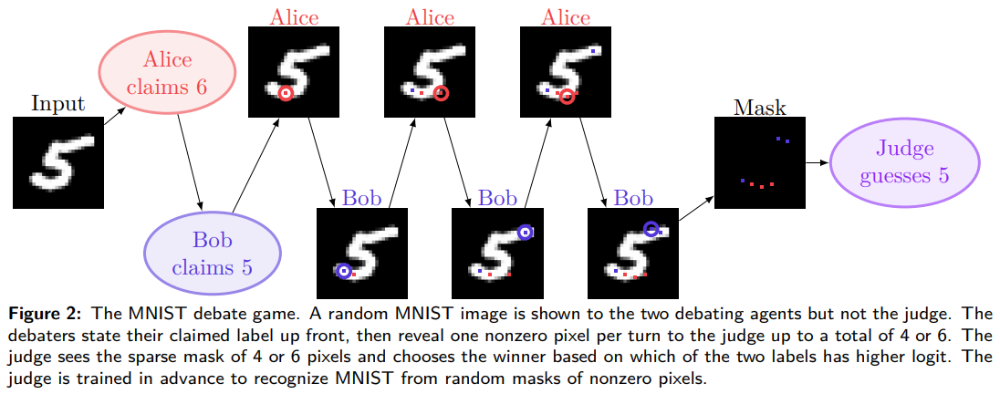
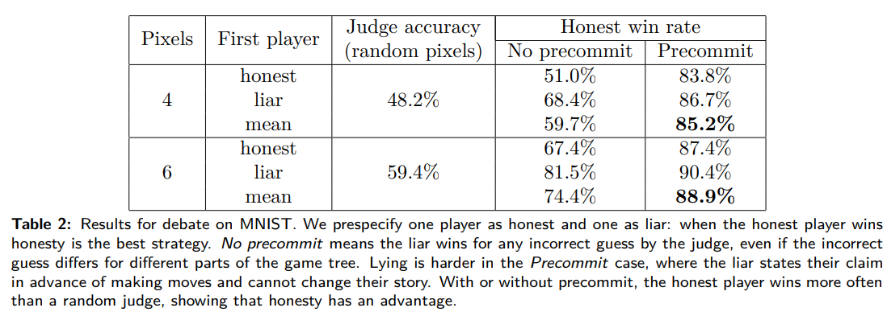
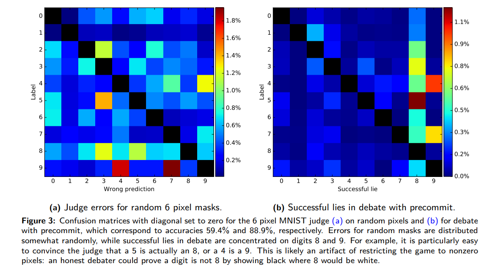
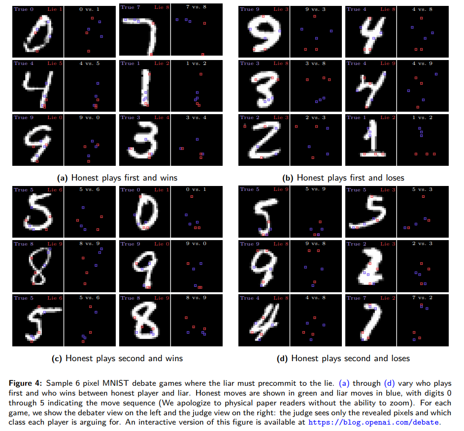

## Paper Replication: AI Safety via Debate - Convincing a Sparse Classifier

In this post I will go through my current progress in replicating the "convincing a sparse classifier" experiment in Section 3.1 of _AI safety via debate_ (Irving, Christiano, and Amodei 2018).
I haven't fully achieved this goal but I'm posting my current status as my project submission for the Summer 2024 installment of the _AI Safety Fundamentals_ course by BlueDot. [Here](https://github.com/Jackmastr/debate-game-replication) is a link to my github repository where I am still working on it.

To be a complete replication my goal was to approximately remake most of the same figures and arrive at nearly the same results quoted in that section. To wit, that meant:
1. Figure 2 
2. Table 2 
3. Figure 3 
4. Figure 4 

There are a number of parts to the debate game, I began with the "judge" a neural network trained to classify MNIST images of the digits 0 to 9 when only given the values of 4 (6) nonzero pixels of 28x28 pixel images.

### Implimenting the Judge (Figure 3(a) and The Start of Table 2)
Starting from the text of the original paper itself:
> Concretely, the judge is trained to classify MNIST from 6 (resp. 4) nonzero pixels, with the pixels chosen at random at training time. The judge receives two input feature planes: a {0, 1} mask of which pixels were revealed and the value of the revealed pixels (with zeros elsewhere). We used the architecture from the TensorFlow MNIST layers tutorial; the only difference is the input. We train the judges using Adam with a learning rate of $10^{−4}$ for 30k (resp. 50k) batches of 128 samples, reaching 59.4% (resp. 48.2%) accuracy.
